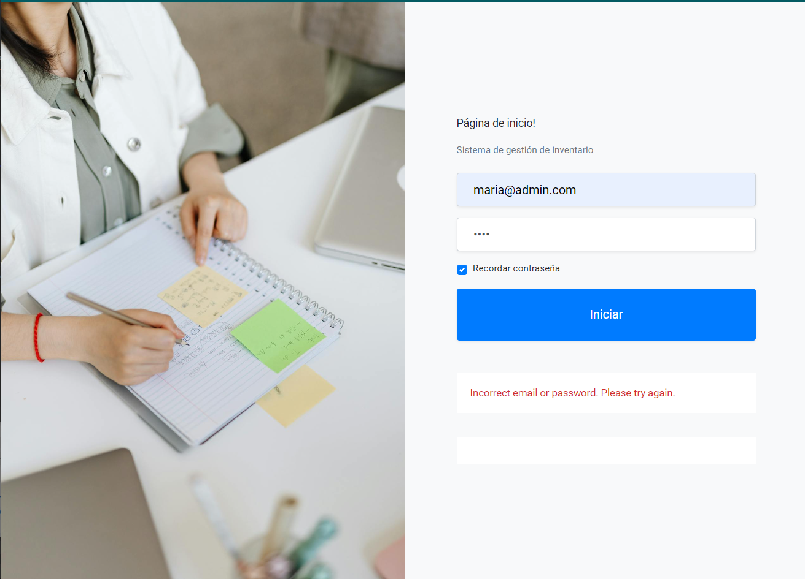

 <h1 align="center"> Sistema de gestión de inventario</h1>
 
 ---
 
  Objetivo

      1. Diseñar e implementar las API REST para integrar con la base de datos SQL
          1. GET todos los equipos de una categoría determinada
          2. GET todos los equipos
          3. POST Para agregar un nuevo equipos
          4. PUT para actualizar un equipo existente
          5. DELETE un equipo
      2. Implementar API con las mejores Prácticas REST.
      3. Implemente un manejo de errores personalizado en las API para manejar todas las excepciones.
      4. Uso de tokens JWT y validacion de todos los endpoints por motivos de seguridad
      5. Desarrollar una interfaz de usuario:
          1. Uso de las API REST para mostrar todos los nombres, descripciones y unidades de equipo en una tabla.
          2. Filtros de datos.
          3. Agregar/Actualizar el producto.
          4. Buscar producto según categoría

  Ingreso:
  
      1. Iniciar sesión en la aplicación Angular.
          
          Credenciales de inicio de sesión:
            username: maria@admin.com
            password:password
            
      2. Realice cualquier operación CRUD.

  Acciones:

        1. Descargar proyecto.
        2. Clone the repository and cd into spring boot files.
        3. Instale las dependencias mediante npm install en Angular.
        5. Cree bases de datos y tablas en su sistema local: 
               1. Cree una base de datos en su sistema: cree la base de datos del Producto;
               2. Crear tablas de Product y User
              (los comandos se proporcionan a continuación en Spring -> src/main/resources-> esquema.sql)
        6. Spring boot en el puerto del servidor 8080 y configure la base de datos con sus credenciales de usuario de mysql (en application.properties).
        7. Ejecutar frontend con -ng serve que se ejecutará en el puerto:4200

        
---

RoadMap to test Inventory Management System project:
-----------------------------------------------------------------------------------------------

This project was generated with Angular CLI: 12.2.3.

Crear Tablas:   
-----------------------------------------------------------------------------------------------

Credenciales para iniciar sesión en mi sql: - (cambio en el archivo application.properties en Spring Project)

1. Crear base de datos Product-

        create database Product;
	
2. Crear tabla Product-
	
	    use Product;
        drop table Product;
        create table Product(
        productId varchar(256) Unique not null,
        productName varchar(256),
        productDescription varchar(3500),
        productCategory varchar(256),
        units int
        );

3. Crear tabla User-

	
        drop table User;
        create table User(
        username varchar(256),
        password varchar(256)
        );

4. Inserción de datos manuales en la tabla de User.

		use Product;
		insert into User(username,password) Values("maria@admin.com","$2a$10$slYQmyNdGzTn7ZLBXBChFOC9f6kFjAqPhccnP6DxlWXx2lPk1C3G6");
        insert into User(username,password) Values("maria","$2a$10$ZnnAdfh3cc7a/b1aODLeoOjifNPbHL6Vo8kpRJj.muPsVp1697hJO");
		
		//Estas son contraseñas cifradas usando Bcrypt.
		
		1st significa:- username - maria@admin.com, password- password
		2nd significa:- username - maria, password- 1234

Nota: Las mismas declaraciones SQL también están presentes en el archivo esquema.sql (src/main/resources)
-----------------------------------------------------------------------------------------------

# Conoce el servidor:

1. Loguearse en el aplicativo atraves de postman o cualquier herramienta de testeo de APIs-

Post Request - http://localhost:8080/airbusManagement/JWT/authenticateUser

    Expecting Json data- {username, password}

2. GET todos los equipos -

Get Request - http://localhost:8080/airbusManagement/getAllProducts 
 
      expecting header - { 'Authorization', Bearer ${token} }.

3. GET todos los equipos por categoria-

Get Request - http://localhost:8080/airbusManagement/getProductsByCategory/{categoryName} 

    expecting header - { 'Authorization', Bearer ${token} }.

4. Add equipos -

Post Request - http://localhost:8080/airbusManagement/addProduct 

      Expecting Json data - {productId,productName,productDescription,productCategory,units} 
      expecting header - { 'Authorization', Bearer ${token} }.

5. Actualizar equipo -

Post Request - http://localhost:8080/airbusManagement/updateProduct/{ProductId} 

      Expecting Json data - {productId,productName,productDescription,productCategory,units} 
      expecting header - { 'Authorization', Bearer ${token} }.
    

6. Delete equipo-

Delete Request - http://localhost:8080/airbusManagement/deleteProduct/{ProductId}

    expecting header - { 'Authorization', Bearer ${token} }.

Stack:

    -Spring Boot Application
    -Spring MVC
    -Spring Jdbc
    -Maven
    -sql database
    -Angular

Pasos para la ejecucion de Angular:

      1.npm install (install node modules), ng serve, npm run build, npm serve.

features used for UI display:

      1. Angular Material
      2. Responsive Design, Bootstrap, HTML 5.1, CSS

#Imagenes del aplicativo

Este projecto evidencia lo siguiente
- Interfaz del usuario
- Login
  
- Menu

- Filtros

- Base de datos

- APIs testeadas con Postman para validar cada endpoint
- 
- 
